<!-- ========================= HEADER ========================= -->
<div align="center">


<a href="https://git.io/typing-svg">
  
</a>

<br/>

<a href="https://linkedin.com/in/mayursaitwal"></a>
<a href="mailto:mayurgsaitwal@gmail.com"></a>
<a href="https://github.com/MayurSaitwal"></a>

<br/><br/>


</div>

<br/>

<!-- ========================= ABOUT ========================= -->
## 👨‍💻 About Me

```yaml
name:     Mayur Saitwal
role:     Computer Engineering Student
focus:    [Cloud, DevOps, Kubernetes, CI/CD, Infrastructure as Code]
cloud:    AWS
learning: [Jenkins, Ansible, Prometheus, Grafana, Advanced AWS, AI-powered DevOps]
mission:  Build reliable, automated and scalable infrastructure
goal:     Cloud / DevOps / SRE opportunities
```

I love taking an application through its **entire lifecycle**:


- ☁️ Building and deploying applications on **AWS**
- 🐳 Containerizing apps with **Docker**
- ☸️ Deploying and managing workloads with **Kubernetes**
- 🔄 Building CI/CD pipelines with **Jenkins** & **GitHub Actions**
- 🏗️ Automating infrastructure with **Terraform**
- 📊 Exploring **Prometheus & Grafana** for observability
- 🤖 Exploring **AI / LLMs for DevOps automation**

<br/>

<!-- ========================= TECH STACK ========================= -->
## 🛠️ Tech Stack

<div align="center">

| | |
|:--|:--|
| **☁️ Cloud & IaC** |  &nbsp;   |
| **⚙️ CI/CD & Version Control** |  |
| **☸️ Containers & Orchestration** |  |
| **📊 Monitoring & Automation** |  |
| **💻 Programming** |  |
| **🗄️ Databases** |  |

</div>

<br/>

<!-- ========================= PROJECTS ========================= -->
## 🚀 Featured Projects

### ☁️ Three-Tier Application on AWS EKS


A production-style **React + Node.js + MongoDB** application deployed on Amazon EKS.

- 🐳 Dockerized frontend, backend & database
- 📦 Images stored in **Amazon ECR**
- ☸️ Kubernetes Deployments, Services & Secrets
- 💾 Persistent Volumes & PVCs for MongoDB
- 🌐 **AWS Application Load Balancer** via Helm-installed AWS Load Balancer Controller
- 🔑 IAM / **IRSA** integration for secure pod-level permissions

<br/>

### ⚙️ End-to-End CI/CD Pipeline with Kubernetes Monitoring


Automates delivery from a code commit all the way to a monitored Kubernetes deployment.

```text
GitHub ➜ Jenkins ➜ Build ➜ Test ➜ Docker ➜ Registry ➜ Kubernetes ➜ Prometheus + Grafana
```

<br/>

### 🏗️ Multi-Environment Infrastructure with Terraform


Infrastructure as Code across environments:

```text
Development  ➜  Staging  ➜  Production
```

Focus: reusable modules, clean environment separation and automated provisioning.

<br/>

### 🤖 AI-Powered Cloud & DevOps Projects
Exploring where **AI meets DevOps**: AI-assisted automation, cloud-based AI apps and LLM-powered workflows.

<br/>

<!-- ========================= STATS ========================= -->
## 📈 GitHub Stats

<div align="center">


</div>

<br/>

<!-- ========================= JOURNEY ========================= -->
## 🧩 My DevOps Journey

```mermaid
flowchart LR
    A[🐧 Linux] --> B[🔀 Git & GitHub]
    B --> C[☁️ AWS]
    C --> D[🐳 Docker]
    D --> E[☸️ Kubernetes]
    E --> F[🏗️ Terraform]
    F --> G[🔄 CI/CD]
    G --> H[📊 Monitoring]
    H --> I[🤖 AI + DevOps]
    style A fill:#FCC624,color:#000
    style C fill:#FF9900,color:#000
    style D fill:#2496ED,color:#fff
    style E fill:#326CE5,color:#fff
    style F fill:#7B42BC,color:#fff
    style G fill:#D24939,color:#fff
    style H fill:#E6522C,color:#fff
    style I fill:#10b981,color:#fff
```



<br/>

## 🎯 2026–27 Goals

| Status | Goal |
|:--:|:--|
| ✅ | Linux fundamentals |
| ✅ | AWS fundamentals |
| ✅ | Docker |
| ✅ | Kubernetes |
| ✅ | GitHub Actions |
| ✅ | Terraform |
| 🔄 | Jenkins CI/CD |
| ⏳ | Ansible |
| ⏳ | Prometheus & Grafana |
| ⏳ | Advanced AWS |
| ⏳ | AI-powered DevOps |
| ⏳ | Contribute to Open Source |
| ⏳ | Build production-grade Cloud/DevOps projects |

<br/>

## 💡 Engineering Philosophy

<div align="center">

> **“Automate what can be automated.”**
>
> **Build it. Break it. Understand it. Automate it.**

</div>

<br/>

## 📫 Let's Connect

<div align="center">

I'm actively looking for **Cloud / DevOps / SRE** opportunities and love collaborating on open-source and infrastructure projects.

<a href="https://linkedin.com/in/mayursaitwal"></a>
<a href="mailto:mayurgsaitwal@gmail.com"></a>

⭐ *If you find my projects useful, consider giving them a star!*


</div>
